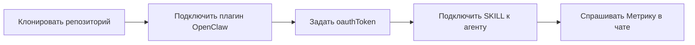

<div align="center">

# Yandex Metrika Assistant

**Навык OpenClaw + документация для API Яндекс.Метрики**

[](./LICENSE)
[](https://yandex.ru/dev/metrika)
[](https://t.me/maya_pro)

*Отчёты · Logs · Счётчики и цели · OAuth · Сценарии для нейросети*

</div>

---

## Содержание

- [Зачем этот репозиторий](#зачем-этот-репозиторий)
- [Кому подойдёт](#кому-подойдёт)
- [Что умеет навык](#что-умеет-навык)
- [Быстрый старт](#быстрый-старт)
- [Примеры применения](#примеры-применения)
- [Примеры HTTP и PowerShell](#примеры-http-и-powershell)
- [Структура проекта](#структура-проекта)
- [Конфигурация плагина](#конфигурация-плагина)
- [Безопасность](#безопасность)
- [Ссылки](#ссылки)

---

## Зачем этот репозиторий

Репозиторий объединяет:

| Компонент | Назначение |
|-----------|------------|
| **[`SKILL.md`](./SKILL.md)** | Как **нейросети** (OpenClaw) выбирать endpoint, не путать `ym:s:` / `ym:pv:`, работать с секретами и квотами |
| **`docs/`** | Сжатая справка по **официальному** API: OAuth, квоты, stat, logs, импорт, management |
| **`openclaw.plugin.json`** | Контракт плагина: токен и опции в одном месте |

Официальный источник правды по API: [**yandex.ru/dev/metrika**](https://yandex.ru/dev/metrika).

---

## Кому подойдёт

- Владельцам сайтов и маркетологам, которые хотят **спрашивать Метрику у AI** в осмысленной форме.
- Разработчикам **автоматизации** (Make.com, сценарии, cron) — готовые паттерны запросов.
- Интеграторам **OpenClaw** / агентов с доступом к shell и секретам.

---

## Что умеет навык

<details>
<summary><strong>Отчёты (Reporting API)</strong></summary>

- Таблицы `GET /stat/v1/data`, динамика `bytime`, сравнение сегментов, drilldown.
- Пресеты (`preset=`) как в веб-интерфейсе Метрики.
- Сегментация через `filters`, лимиты метрик/группировок из доки.

</details>

<details>
<summary><strong>Управление и Logs</strong></summary>

- Список счётчиков, цели, типовые `management`-операции.
- Сценарий Logs API: создание выгрузки → статус → скачивание → `clean`.

</details>

<details>
<summary><strong>Импорт и токены</strong></summary>

- Направления импорта (расходы, CRM, офлайн и т.д.) со ссылками на методы.
- Инструкция получения OAuth-токена на русском + скрипт обмена `code` → token.

</details>

Матрица «**как спросили человеком → какой API**»: [`docs/10-user-intents-matrix.md`](./docs/10-user-intents-matrix.md).

---

## Быстрый старт



1. **Клонируйте** репозиторий (или скопируйте папку в каталог навыков OpenClaw):

   ```bash
   git clone https://github.com/Horosheff/yandex-metrika-assistant.git
   ```

2. Зарегистрируйте плагин с id **`yandex-metrika-assistant`** — файл [`openclaw.plugin.json`](./openclaw.plugin.json).

3. В настройках плагина укажите **`oauthToken`** (токен Яндекса с правами Метрики).  
   Опционально: **`defaultCounterId`**, **`oauthClientId`**.

4. Убедитесь, что агент подхватывает [`SKILL.md`](./SKILL.md).

> **Альтернатива:** переменная окружения **`YANDEX_METRIKA_OAUTH_TOKEN`** (если ваш хост OpenClaw так устроен).

Токен для людей: [`docs/INSTRUCTION-GET-TOKEN-RU.md`](./docs/INSTRUCTION-GET-TOKEN-RU.md).

---

## Примеры применения

Ниже — **не код**, а сценарии: что пишет пользователь и как должен вести себя агент с подключённым навыком.

| # | Вы спрашиваете | Что делает агент |
|---|----------------|------------------|
| 1 | *«Покажи визиты по дням за последний месяц по сайту X»* | Находит счётчик (`search_string` или `defaultCounterId`), дергает `stat/v1/data` с `dimensions=ym:s:date`, выводит таблицу по дням. |
| 2 | *«На какие страницы больше всего заходят?»* | Запрос с префиксом **`ym:pv:`**: URL + просмотры, сортировка по убыванию, топ N. |
| 3 | *«Откуда трафик, сводка по источникам»* | `preset=sources_summary` или явные dimensions по источникам из справочника. |
| 4 | *«Сравни мобильный и десктоп за неделю»* | Метод сравнения сегментов `/stat/v1/data/comparison` (см. официальные примеры). |
| 5 | *«Выгрузи отчёт в Excel»* | Подсказывает запрос к `.../stat/v1/data.csv?...` с нужными параметрами. |
| 6 | *«Нужны сырые логи визитов»* | Объясняет цикл Logs API (create → poll → download → **clean**), ссылка на `docs/06-logs-api.md`. |
| 7 | *«Как получить API-ключ?»* | Объясняет, что нужен **OAuth access_token**, даёт [`INSTRUCTION-GET-TOKEN-RU.md`](./docs/INSTRUCTION-GET-TOKEN-RU.md). |

Больше формулировок («UTM», «Директ», «цели», география…) — в [**матрице намерений**](./docs/10-user-intents-matrix.md).

---

## Примеры HTTP и PowerShell

Готовые команды `curl` и настройка `$env:` — в отдельном файле:

**[docs/EXAMPLES.md](./docs/EXAMPLES.md)** — счётчики, визиты по дням, топ URL, preset, CSV.

---

## Структура проекта

```
yandex-metrika-assistant/
├── SKILL.md                 # Поведение агента OpenClaw
├── openclaw.plugin.json     # id, name, configSchema
├── README.md                # Вы здесь
├── LICENSE
├── .gitignore
├── scripts/
│   └── exchange-yandex-oauth-code.ps1
└── docs/
    ├── EXAMPLES.md          # Примеры curl / PowerShell
    ├── INSTRUCTION-GET-TOKEN-RU.md
    ├── 10-user-intents-matrix.md
    └── 01 … 09 …            # Разделы API (ссылки и выжимки)
```

---

## Конфигурация плагина

| Поле | Тип | Зачем |
|------|-----|--------|
| `oauthToken` | string | Access token Яндекса (`metrika:read` / `metrika:write`) |
| `defaultCounterId` | integer | Подставлять `ids`, если пользователь не назвал счётчик |
| `oauthClientId` | string | Собрать ссылку авторизации, если токена ещё нет |

Схема в JSON: [`openclaw.plugin.json`](./openclaw.plugin.json).

---

## Безопасность

- Не коммитьте токены, не вставляйте их в issue и публичные чаты.
- При утечке — отзовите токен в [Яндекс OAuth](https://oauth.yandex.ru/) и выпустите новый.
- В репозитории учтён [`.gitignore`](./.gitignore) для типичных файлов с секретами.

---

## Ссылки

| Ресурс | URL |
|--------|-----|
| Документация API Метрики | https://yandex.ru/dev/metrika |
| Примеры отчётов | https://yandex.ru/dev/metrika/ru/stat/examples |
| Шаблоны отчётов (preset) | https://yandex.ru/dev/metrika/ru/stat/presets |
| Telegram: автоматизация и нейросети | [**https://t.me/maya_pro**](https://t.me/maya_pro) |

---

## Лицензия

Проект распространяется под лицензией **MIT** — см. файл [LICENSE](./LICENSE).

---

<div align="center">

Если репозиторий полезен — можно поставить звезду на GitHub и заглянуть в [**@maya_pro**](https://t.me/maya_pro).

</div>
